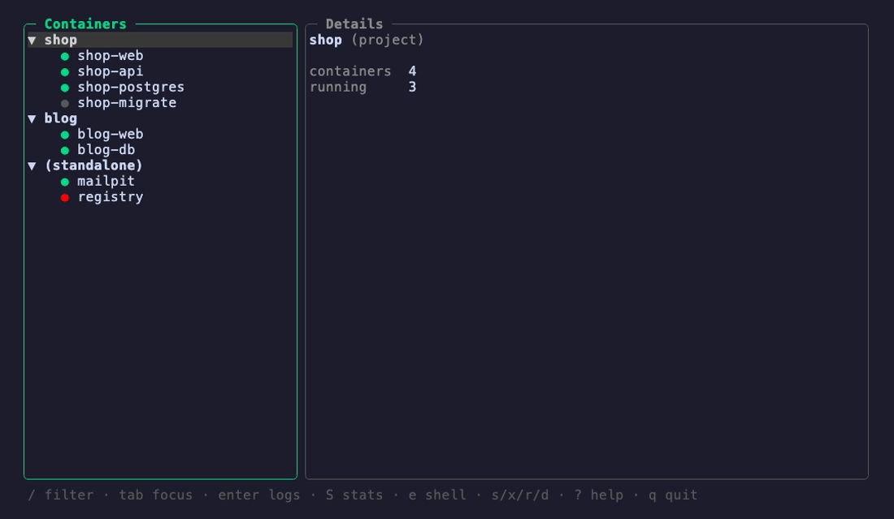

# bosun

A terminal UI for Docker that stays out of your way. Bordered panels, one-key actions, live logs and stats. It is the tool I wanted while babysitting a dozen containers across side projects, so I built it.



> Drop a `demo.gif` in `docs/` and this shows up at the top. Until then, imagine arrow keys, a list on the left, logs scrolling on the right.

## Why

I spend half my day in `docker ps`, `docker logs -f`, `docker exec`, over and over. The web dashboards are heavy and the CLI makes me retype the same three commands. bosun keeps everything one keypress away and never leaves the terminal.

It is not trying to replace Docker Desktop. It is a fast keyboard cockpit for the containers you already have running.

## Install

You need Go 1.24 or newer and a running Docker daemon.

```bash
go install github.com/psychedelicdevx/bosun/cmd@latest
```

Prefer to build it yourself:

```bash
git clone https://github.com/psychedelicdevx/bosun.git
cd bosun
go build -o bosun ./cmd
./bosun
```

## Usage

Run it:

```bash
bosun
```

It connects to your local daemon through the usual socket (it respects `DOCKER_HOST` if you set it), lists every container, and hands you the keyboard. The list on the left is what you navigate. The panel on the right shows details, and switches to logs or stats when you ask for them. Whichever panel has focus gets a green border, same idea as lazygit.

If the daemon is down or the socket is not readable, bosun tells you in plain language instead of dumping a stack trace.

Want to try it without touching your real containers? Run `bosun --demo` for a self-contained sandbox with fake containers, logs, and stats. Handy for screenshots and for kicking the tires.

## Keys

| Key | What it does |
| --- | --- |
| `↑` `↓` or `k` `j` | move through the list |
| `tab` | switch focus between the two panels |
| `enter` | stream logs for the selected container |
| `S` | live CPU and memory |
| `e` | drop into a shell inside a running container |
| `s` | start |
| `x` | stop |
| `r` | restart |
| `d` | remove, and it asks first |
| `esc` | back to the details view |
| `?` | show the keybindings |
| `q` | quit |

Logs follow along at the bottom while new lines arrive. Scroll up and it stops chasing so you can read, then it picks back up once you return to the bottom. The list refreshes itself every couple of seconds, so anything you change from another terminal shows up on its own.

## How it works

The whole thing is one static binary. Under the hood:

- [Bubble Tea](https://github.com/charmbracelet/bubbletea) drives the event loop, with [Lip Gloss](https://github.com/charmbracelet/lipgloss) for the panels and colors.
- The official [Docker Go SDK](https://github.com/docker/docker) talks to the daemon.
- Logs and stats each run in their own goroutine and feed the UI through channels, so streaming never blocks a keypress. Closing a panel cancels its stream cleanly, no leaked goroutines.

## Status

Early but usable every day. Container list, logs, stats, the lifecycle actions, and shell exec all work. Next on the bench: compose project grouping, image and volume panels, and a name filter for when the list gets long.

Issues and pull requests are welcome.

## License

MIT
